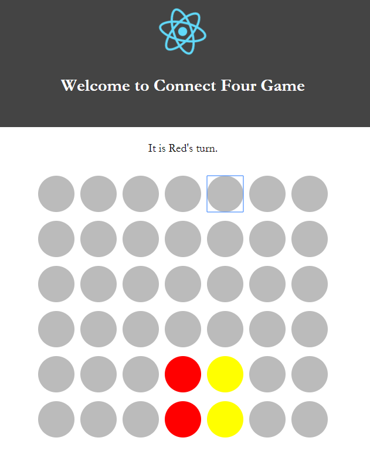

# connect4 Game Implementation
Technology used React + Redux + Jasmine  

# How to start game

1. Download everything through web browser or git  
2. enter root directory  
3. npm install  
4. npm start  

# How to start test
1. enter root directory  
2. npm test  

# Correspondence to Project Requirement
1. game_state sample  
		[  
			['N', 'N', 'N', 'N', 'N', 'N', 'N'],  
			['N', 'N', 'N', 'N', 'N', 'N', 'N'],  
			['N', 'N', 'N', 'N', 'N', 'N', 'N'],  
			['N', 'N', 'N', 'N', 'N', 'N', 'N'],  
			['N', 'N', 'N', 'N', 'N', 'N', 'N'],  
			['N', 'N', 'N', 'R', 'Y', 'LR', 'N']  
		],  
    N stands for empty disc(grey)  
    R stands for red disc  
    Y stands for Yellow disc  
    LR stands for opacity = 0.5 red disc, meaning the projection of red player's next move  
    YR stands for opacity = 0.5 Yellow disc, meaning the projection of yellow player's next move  
    
2.  function get_current_player(board) :  not implmented and not used in my case  

3.  function is_state_valid(board)  : not implmented and not used in my case  

4.  play(game_state, 1, "y"): corresponds to root/reducers/reducers.js function addDisc(board, color, column, row)  

5.  Winner function consists of two functions in my case  
    root/reducers/reducers.js  
    
    function checkDraw(board) and  
    function checkWinner(board, color, column, row)  
    

